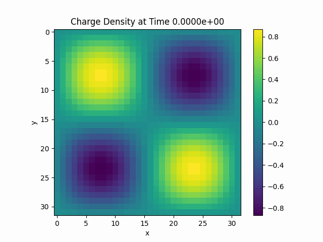
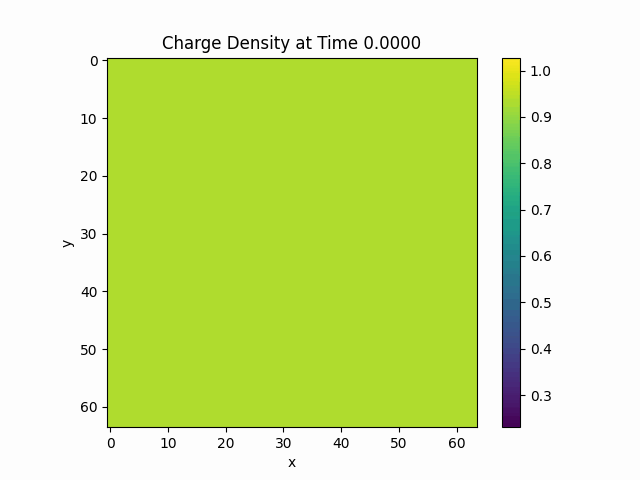
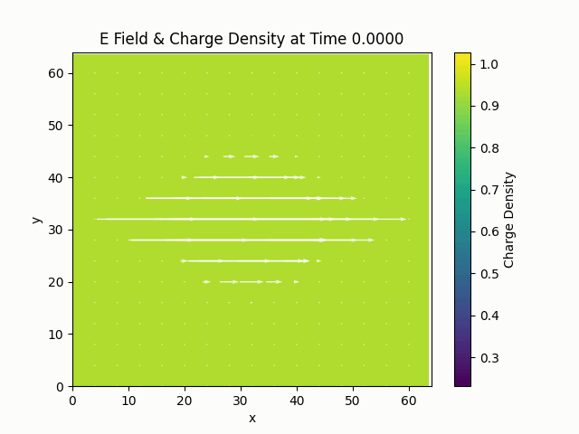

# Laser-Plasma Interactions 
This project implements a C++ solver for modeling the evolution of a collisionless plasma under electromagnetic forcing using the reduced Vlasov-Poisson equation. 

**Course:** MEGN651 - Advanced Computational Fluid Dynamics  
**Team Members:**
- Jenna Ramsey-Rutledge
- Byron Selvage
- Kyle Sperber


## Background

Using lasers to drive a plasma is an active field of research in High Energy Density Physics, Nuclear Fusion, and Atomic, Molecular and Optical Physics. When an intense laser pulse interacts with matter, it can deliver enough energy to ionize atoms and molecules, stripping electrons from their bound states and produce a quasi-neutral plasma consisting of ions and free electrons. Once formed, this plasma can strongly interact with the incident electromagnetic field producing a wide array of nonlinear phenomena.  

The Vlasov-Maxwell system provides a governing set of PDEs that model the evolution of a plasma distribution under electromagnetic forcing. The electromagnetic field due to the plasma charge distribution and the laser's electric field evolves with respect to the Maxwell Equations, while the Vlasov equation describes the evolution of the particle distribution in phase space under the action of the Lorentz force. Together, these equations self-consistently couple particle motion to the electromagnetic field evolution, enabling the study of wave-particle interactions, plasma instabilities, and nonlinear laser-plasma coupling.

## Physics and Mathematical Model

### Governing Equations
In this work, we model the evolution of a collisionless plasma under electromagnetic forcing using the reduced Vlasov-Poisson equation over the spatial domain $\Omega = [0, L_x] \times [0, L_y]$ and the velocity domain $V$. The particle distribution $f(\vec{r}, \vec{v}, t)$ evolves according to the collisionless Vlasov equation,

$$ \frac{\partial f}{\partial t} + \vec{v}\cdot\nabla_{\vec{r}} f + \frac{q}{m}\vec{E}\cdot\nabla_{\vec{v}} f = 0 $$

where $q$ and $m$ denote the particle charge and mass, respectively, and $\vec{E}$ is the applied electric field. The electric field is determined from Poisson's Equation,

$$
\begin{equation*}
    \nabla \cdot \vec{E} = \frac{\rho}{\varepsilon_0}
\end{equation*}
$$

where the charge density $\rho$ is computed from the velocity moments of the distribution function,

$$
\begin{equation*}
    \rho = q \int f(\vec{r}, \vec{v})\, d\vec{v} 
\end{equation*}
$$

and is superimposed with the electric field from the laser;

$$
\begin{equation*}
    \vec{E}(x, y) = E_0 e^{-\frac{x^2 + y^2}{w^2}} (\cos(\pi t)\hat{x} + \sin(\pi t)\hat{y})
\end{equation*}
$$

where $w$ is the beam waist and is about 1 mm. Since electrons are repelled by the laser field away from the region of peak intensity, we expect electrons to form a Gaussian-shaped void at the beam center.

### Initial and Boundary Conditions
To model this we must set initial and boundary conditions. For the boundary conditions we, enforce no inflow

$$
\begin{equation*}
    f(\vec{r}_\text{boundary}, \vec{v}, t) = 0 \quad \vec{v} \cdot \hat{n} <0.
\end{equation*}
$$

For the initial conditions we will first assume that $f$ is separable into its spatial and velocity components. This implies that $f(\vec{r}, \vec{v}, 0) = g(\vec{r}) h(\vec{v})$. To establish the velocity initial condition we will assume that our particles are non-interacting and non-relativistic. From statistical mechanics this means that for the velocity component $h$ we can follow the Maxwell-Boltzmann Distribution

$$
\begin{equation*}
    h(\vec{v}) = \left(\frac{m}{2 \pi k_B T}\right) \exp\left( -\frac{m \vec{v}^2}{2 k_B T} \right).
\end{equation*}
$$

Here $k_B$ is the Boltzmann constant and $T$ is the temperature. We will assume room temperature at about $278.15^\circ K$.

For the spatial initial condition, we will assume that the particles are uniformly distributed about our domain, giving 

$$
\begin{equation*}
    g(\vec{r}) = \mathcal{U}(\vec{r}).
\end{equation*}
$$

This acts to ensure that our atmosphere is initially charge neutral as we get

$$
\begin{align*}
    \rho &= \int_\Omega \int_V f(\vec{r}, \vec{v})\\
    &= \int_\Omega \int_V g(\vec{r}) h(\vec{v})\\
    &= \int_\Omega \left(q_{e^-}\mathcal{U}_{e^-} + q_{\text{cations}} \, \mathcal{U}_\text{cations}\right) \int_V h(\vec{v})\\
    &= \int_\Omega \left(q_{e^-}\mathcal{U}_{e^-} + q_{\text{cations}} \, \mathcal{U}_\text{cations}\right) \cdot 1\\
    \rho &= (-q + q) \cdot 1 = 0
\end{align*}
$$

For the electric field the boundary conditions are quite simple. We will assume that as we leave the main region of interaction the field goes to zero quickly giving the Dirichlet condition $\vec{E}(\vec{r}_\text{boundary}) = 0$.


## Numerical Methods
This system is solved using a five step algorithm. 
1. Assemble the total electric field from superimposing the plasma field and the external laser field. 
2. Implicitly solve the Vlasov equation to obtain the updated distribution function. 
3. Integrate the distribution function over velocity space to obtain the charge density. 
4. Solve the Poisson equation for the electrostatic potential.
5. Compute the electric field from the gradient of the potential.   

Each step is described in detail in the following paragraphs.

The system is solved on a structured Cartesian phase-space mesh, where spatial coordinates are discretized over the domain 

$$\Omega = [0, L_x] \times [0,L_y]$$

and velocity space is discretized over

$$V = [v_{x,min},v_{x,max}] \times [v_{y,min},v_{y,max}].$$

Ghost cells are included on each boundary to simplify the implementation of boundary conditions and application of finite difference stencils. Spatial and velocity-space derivatives are approximated using first order upwind finite differences. To advance the PDE in time, we used a first order implicit backward Euler discretization. The resulting update equation is written as 

$$\frac{f^{n+1}-f^n}{\Delta t} + \vec{v} \cdot \nabla_{\vec{r}} f + \frac{q}{m}\vec{E}\cdot \nabla_v f^{n+1} = 0.$$

All advective terms are handled with upwinding. The upwind direction is selected dynamically based on the sign of local velocity or acceleration. For instance, a positive particle velocity uses a backward spatial stencil while a negative one uses a forward stencil. 

The fully implicit discretization produces a nonlinear algebraic system for the updated distribution function, which is solved using fixed-point iteration with the Gauss-Seidel method. At each iteration, neighboring phase-space values from the previous iterate are used to compute an updated distribution function. Iteration continues until the maximum pointwise change between consecutive iterations falls below 1.0e-10. 

The electrostatic potential is obtained from Poisson's equation,

$$ \nabla^2 \phi = \frac{\rho}{\epsilon _0}, $$

where charge density $\rho$ is computed from the velocity-space moments of the distribution function. Poisson's equation is discretized using a second-order centered finite difference approximation. At interior nodes, we use the standard five-point stencil, 

$$ \frac{\phi_{i+1,j}-2\phi_{i,j}+\phi_{i-1,j}}{\Delta x^2} + \frac{\phi_{i,j+1}-2\phi_{i,j}+\phi_{i,j-1}}{\Delta y^2} = \frac{\rho_{i,j}}{\epsilon _0}. $$

Boundary and ghost cell conditions are incorporated directly into the sparse system matrix. The resulting linear system is assembled into sparse matrix form using the Eigen library and solved using the built-in `SparseLU` solver. 

The electric field due to the plasma charge distribution is then recovered from the potential gradient,

$$\vec{E}_{charge} = -\nabla \phi,$$

and superimposed with the externally applied electric field produced by the laser to form the total electric field. The entire process is then repeated for the next timestep.

## Verification
First, we verified that our Poisson solver converges at the expected rate. We used the manufactured solution 

$$v(x,y) = \sin(x)\sin(y).$$

and varied our grid spacing $dx$. This confirmed that our solver had an average convergence rate of 1.99, as expected.

Next, we checked that the iterative implicit solver ran with minimal error. To do this, we set the electric field equal to zero then ran a single solver iteration. With this, the maximum error was 8.97014e-24.

Finally, the iterative solver was verified using the Method of Manufactured Solutions. The test solution

$$f = \frac{sin(x)sin(y)cos(t)}{L_{vx} L_{vy}}$$

was prescribed over the domain $L_x = L_y = 2\pi$ with a manufactured forcing function $g(x, y, v_x, v_y, t)$ derived by substituting $f$ into the Vlasov equation analytically. We found

$$g = \frac{-\sin(x)\sin(y)\sin(t)}{L_{vx}L_{vy}} + \frac{v_x\cos(x)\sin(y)\cos(t)}{L_{vx}L_{vy}} + \frac{v_y\sin(x)\cos(y)\cos(t)}{L_{vx}L_{vy}}.$$

The solver was run with this forcing function and the computed solution was compared to the exact $f$ over a full simulation for $t \in [0, 2\pi]$. In this test, $f$ converged to the expected solution over the full simulation time, shown below.



## Results
The solver is initialized with electrons uniformly distributed across the domain and the laser field off. Once the laser pulse is activated, the electron distribution is rapidly expelled outward from the beam center, forming a Gaussian-shaped void. This behavior is physically consistent, as the strong electric field of the laser repels electrons away from the region of peak intensity.



The dominant contribution to the total electric field comes from the laser rather than the self-consistent plasma field. Because the laser is circularly polarized, its electric field vector rotates in the $xy$-plane over each optical cycle. This rotating field continuously redistributes the charge density, causing the "smearing" along the current field direction. This can be better seen with the electric field lines superimposed on the charge density.




## Quick Start

### Prerequisites

- C++17-compatible compiler
- GNU Make
- Eigen 5.0.0+

### Building and Running
Before running, update the Eigen path in the `makefile`.

```bash
# Clone the repository
git clone <repo-url>
cd vlasov_maxwell

# Compile the project
make build

# Run the program
./build/solver.exe

# Remove compiled artifacts
make clean

# Build and run in one step
make all
```

### Adjusting the Simulation

Edit the CSV files in `input/` to change the spatial domain, velocity domain, or resolution before building


## Project Structure

```
vlasov_maxwell/
├── src/                              # Source and header files
│   ├── DistributionFunction.{cpp,h}  # Particle distribution function
│   ├── FileIO.{cpp,h}                # Helper functions for reading inputs
│   ├── Mesh2D.{cpp,h}                # Spatial + velocity mesh
│   ├── Operators.{cpp,h}             # Gradient and integrate operators
│   ├── ScalarField.{cpp,h}           # Scalar field data structure for charge density
│   ├── SimulationTime.{cpp,h}        # Time stepping
│   ├── Solvers.cpp                   # Poisson and iterative implicit solver
│   ├── VectorField.{cpp,h}           # Vector field data structure for electric field 
│   ├── main.cpp
│   └── README.md
├── input/                            # Configuration files
│   ├── mesh_grid.csv                 # Spatial + velocity mesh parameters
│   ├── time_grid.csv                 # Time stepping parameters
│   └── README.me
├── output/                           # Results
├── scripts/                          # Postprocessing scripts
|   ├── plot_results.py               # Produces visualizations of charge density and the Electric field
│   └── README.md                       
├── tests/                           # Test Module
│   ├── test_poisson.cpp             # Runs tests for building the poisson equation 
│   ├── test_solver.cpp              # Runs tests for the iterative implicit solver
|   ├── mms.cpp                      # Runs method of manufactured solution test
│   └── makefile                     # Build test suites
├── makefile                         # Build configuration
└──README.md                         # This file
```

## References

- Brewer, Dustin & Pankavich, Stephen. (2011). Computational Methods for a One-Directional Plasma Model with Transport Field. SIAM Undergraduate Research Online. 4. 10.1137/11S010906. 
